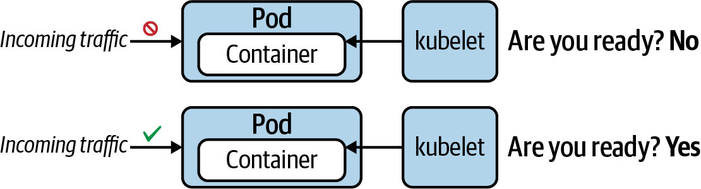

# Kubernetes

## Table of Contents

- [Generally Helpful Info](#generally-helpful-info)
  - [Get top 10 beginning lines](#get-top-10-beginning-lines)
  - [Streams tail end contents](#streams-tail-end-contents)
  - [Using an Alias for `kubectl`](#using-an-alias-for--kubectl-)
  - [Get API Resource Short Names](#get-api-resource-short-names)
- [`config`](#config)
  - [Setting a Context and Namespace](#setting-a-context-and-namespace)
- [`top`](#top)
  - [Check node/pod memory & CPU usage](#check-node-pod-memory---cpu-usage)
- [`describe`](#describe)
  - [Listing of a series of events](#listing-of-a-series-of-events)
- [`explain`](#explain)
- [`create`](#create)
  - [Get help on creatable resources](#get-help-on-creatable-resources)
- [`apply`](#apply)
  - [Create resources from file](#create-resources-from-file)
- [`delete`](#delete)
  - [Force kill/delete](#force-kill-delete)
  - [Delete now](#delete-now)
- [`get`](#get)
  - [Get YAML manifest of existing resource](#get-yaml-manifest-of-existing-resource)
  - [Get all events for a given namespace](#get-all-events-for-a-given-namespace)
  - [Get events for an individual resource](#get-events-for-an-individual-resource)
  - [Get service endpoints](#get-service-endpoints)
  - [Get specific service endpoints](#get-specific-service-endpoints)
  - [Multiple resource types](#multiple-resource-types)
- [`logs`](#logs)
  - [Get logs from a specific container](#get-logs-from-a-specific-container)
  - [Get logs from previously ran container](#get-logs-from-previously-ran-container)
  - [Stream logs](#stream-logs)
  - [Aggregated logs from all containers with a specifc label](#aggregated-logs-from-all-containers-with-a-specifc-label)
- [`debug`](#debug)
  - [Create debug ephemeral container](#create-debug-ephemeral-container)
- [ConfigMap](#configmap)
  - [Creating a ConfigMap](#creating-a-configmap)
    - [*Create a new config map named my-config based on folder bar*](#-create-a-new-config-map-named-my-config-based-on-folder-bar-)
    - [*Create a new config map named my-config with specified keys instead of file basenames on disk*](#-create-a-new-config-map-named-my-config-with-specified-keys-instead-of-file-basenames-on-disk-)
    - [*Create a new config map named my-config with key1=config1 and key2=config2*](#-create-a-new-config-map-named-my-config-with-key1-config1-and-key2-config2-)
    - [*Create a new config map named my-config from the key=value pairs in the file*](#-create-a-new-config-map-named-my-config-from-the-key-value-pairs-in-the-file-)
    - [*Create a new config map named my-config from an env file*](#-create-a-new-config-map-named-my-config-from-an-env-file-)
  - [Use ConfigMap in a Pod manifest via `envFrom.configMapRef`](#use-configmap-in-a-pod-manifest-via--envfromconfigmapref-)
  - [Redefine keys from a ConfigMap](#redefine-keys-from-a-configmap)
  - [Mounting a ConfigMap as a Volume](#mounting-a-configmap-as-a-volume)
- [Secret](#secret)
  - [Creating a generic Secret](#creating-a-generic-secret)
    - [*Literal Values*](#-literal-values-)
    - [*File containing environment variables*](#-file-containing-environment-variables-)
    - [*SSH key file*](#-ssh-key-file-)
  - [A Secret with Base64-encoded values](#a-secret-with-base64-encoded-values)
  - [Injecting key-value pairs of a Secret into a container](#injecting-key-value-pairs-of-a-secret-into-a-container)
  - [Mounting a Secret as a Volume](#mounting-a-secret-as-a-volume)
- [Security Context](#security-context)
  - [Setting a security context on the container level](#setting-a-security-context-on-the-container-level)
  - [Setting a security context on the Pod level](#setting-a-security-context-on-the-pod-level)
- [ResourceQuota](#resourcequota)
  - [Defining hard resource limits with ResourceQuota](#defining-hard-resource-limits-with-resourcequota)
  - [A Pod with resource requirements](#a-pod-with-resource-requirements)
- [Service Accounts](#service-accounts)
  - [Query for available Service Accounts](#query-for-available-service-accounts)
  - [Create a new Service Account](#create-a-new-service-account)
- [Multi-Container Pods](#multi-container-pods)
  - [A Pod defining an init Container](#a-pod-defining-an-init-container)
  - [The Sidecar Pattern](#the-sidecar-pattern)
    - [An exemplary sidecar pattern implementation](#an-exemplary-sidecar-pattern-implementation)
  - [The Adapter Pattern](#the-adapter-pattern)
    - [An exemplary adapter pattern implementation](#an-exemplary-adapter-pattern-implementation)
  - [The Amassador Pattern](#the-amassador-pattern)
    - [Node.js HTTP rate limiter implementation](#nodejs-http-rate-limiter-implementation)
    - [An exemplary ambassador pattern implementation](#an-exemplary-ambassador-pattern-implementation)
- [Health Probes](#health-probes)
  - [Readiness Probe](#readiness-probe)
    - [A readiness probe that uses an HTTP GET request](#a-readiness-probe-that-uses-an-http-get-request)
  - [Liveness Probe](#liveness-probe)
    - [A liveness probe that uses a custom command](#a-liveness-probe-that-uses-a-custom-command)
  - [Startup Probe](#startup-probe)
    - [A startup probe that uses a TCP socket connection](#a-startup-probe-that-uses-a-tcp-socket-connection)

## Generally Helpful Info

### Get top 10 beginning lines

```sh
head -n 10 [file]
```

### Streams tail end contents

```sh
tail -f [file]
```

> Last 5 lines

```sh
kubectl describe pod [pod] | tail -n 5
```

### Using an Alias for `kubectl`

```sh
alias k=kubectl
k version
```

### Get API Resource Short Names

```sh
$ kubectl api-resources
NAME                    SHORTNAMES  APIGROUP  NAMESPACED  KIND
...
persistentvolumeclaims  pvc                   true        PersistentVolumeClaim
...
```

## `config`

### Setting a Context and Namespace

```sh
kubectl config set-context <context-of-question> \
  --namespace=<namespace-of-question>
```

## `top`

> NOTE: [Metrics server](https://github.com/kubernetes-sigs/metrics-server) must be enabled to use `top`

### Check node/pod memory & CPU usage

```sh
kubectl top nodes
kubectl top pods
```

## `describe`

### Listing of a series of events

```sh
$ kubectl describe pod/non-root
...
Events:
Type     Reason     Age              From               Message
----     ------     ----             ----               -------
Normal   Scheduled  <unknown>        default-scheduler  Successfully assigned \
                                                        default/non-root to minikube
Normal   Pulling    18s              kubelet, minikube  Pulling image "nginx:1.18.0"
Normal   Pulled     14s              kubelet, minikube  Successfully pulled image \
                                                        "nginx:1.18.0"
Warning  Failed     0s (x3 over 14s) kubelet, minikube  Error: container has \
                                                        runAsNonRoot and image \
                                                        will run as root
```

## `explain`

```sh
$ kubectl explain pods.spec
KIND:     Pod
VERSION:  v1

RESOURCE: spec <Object>

DESCRIPTION:
  ...

FIELDS:
  ...
```

## `create`

### Get help on creatable resources

```sh
$ kubectl create --help
Create a resource from a file or from stdin.

JSON and YAML formats are accepted.

Examples:
  ...

Available Commands:
  ...

Options:
  ...
```

## `apply`

> Stateful/Declarative approach compared to imperative `create` command unless the equivalent `kubectl create -f [file] --save-config` is ran.

### Create resources from file

```sh
kubectl apply -f [file]
```

## `delete`

### Force kill/delete

> Use the command line option --grace-period=0 and --force to send a SIGKILL signal. The signal will delete a Kubernetes object immediately

```sh
kubectl delete [resource] [name] --grace-period=0 --force
```

### Delete now

```sh
kubectl delete [resource] [name] --now
```

## `get`

### Get YAML manifest of existing resource

```sh
kubectl get [resource] [name] -o yaml > manifest.yaml
```

### Get all events for a given namespace

```sh
kubectl get events
```

### Get events for an individual resource

```sh
kubectl get events --field-selector=involvedObject.name=[object name]
```

### Get service endpoints

```sh
$ kubectl get endpoints
NAME         ENDPOINTS           AGE
kubernetes   192.168.65.4:6443   15d
mylb         10.1.0.42:80        5m5s
```

### Get specific service endpoints

```sh
$ kubectl get endpoints myservice
NAME        ENDPOINTS                     AGE
myservice   172.17.0.5:80,172.17.0.6:80   9m31s
```

### Multiple resource types

```sh
kubectl get statefulsets,services --all-namespaces --field-selector metadata.namespace!=default
```

## `logs`

### Get logs from a specific container

```sh
kubectl logs business-app -c configurer
```

### Get logs from previously ran container

```sh
kubectl logs [resource]/[pod] -p
```

### Stream logs

```sh
kubectl logs [resource]/[pod] -f
```

### Aggregated logs from all containers with a specifc label

```sh
kubectl logs --selector=[label]
kubectl logs --selector=app=my-app
```

## `debug`

> NOTE: Ephemeral containers are still considered an experimental feature. The cluster has to enable the feature flag to work.

- [Ephemeral Containers](https://kubernetes.io/docs/concepts/workloads/pods/ephemeral-containers/)
- [Debugging with an ephemeral debug container](https://kubernetes.io/docs/tasks/debug-application-cluster/debug-running-pod/#ephemeral-container)

### Create debug ephemeral container

> If you specify the `-i`/`--interactive` argument, `kubectl` will automatically attach to the console of the Ephemeral Container.

```sh
kubectl debug [pod] -it --image=busybox
```

## ConfigMap

### Creating a ConfigMap

#### *Create a new config map named my-config based on folder bar*

```sh
kubectl create configmap my-config --from-file=path/to/bar
```

#### *Create a new config map named my-config with specified keys instead of file basenames on disk*

```sh
kubectl create configmap my-config --from-file=key1=/path/to/bar/file1.txt --from-file=key2=/path/to/bar/file2.txt
```

#### *Create a new config map named my-config with key1=config1 and key2=config2*

```sh
kubectl create configmap my-config --from-literal=key1=config1 --from-literal=key2=config2
```

#### *Create a new config map named my-config from the key=value pairs in the file*

```sh
kubectl create configmap my-config --from-file=path/to/bar
```

#### *Create a new config map named my-config from an env file*

```sh
kubectl create configmap my-config --from-env-file=path/to/foo.env --from-env-file=path/to/bar.env
```

### Use ConfigMap in a Pod manifest via `envFrom.configMapRef`

```yaml
apiVersion: v1
kind: Pod
metadata:
  name: configured-pod
spec:
  containers:
  - image: nginx:1.19.0
    name: app
    envFrom:
    - configMapRef:
        name: backend-config
```

### Redefine keys from a ConfigMap

```yaml
apiVersion: v1
kind: Pod
metadata:
  name: configured-pod
spec:
  containers:
  - image: nginx:1.19.0
    name: app
    env:
    - name: DATABASE_URL
      valueFrom:
        configMapKeyRef:
          name: backend-config
          key: database_url
    - name: USERNAME
      valueFrom:
        configMapKeyRef:
          name: backend-config
          key: user
```

### Mounting a ConfigMap as a Volume

```yaml
apiVersion: v1
kind: Pod
metadata:
  name: configured-pod
spec:
  containers:
  - image: nginx:1.19.0
    name: app
    volumeMounts:
    - name: config-volume
      mountPath: /etc/config
  volumes:
  - name: config-volume
    configMap:
      name: backend-config
```

```sh
$ kubectl exec -it configured-pod -- /bin/sh
# ls -1 /etc/config
database_url
user
# cat /etc/config/database_url
jdbc:postgresql://localhost/test
# cat /etc/config/user
fred
```

## Secret

> If you create secrets imperitively then kubernetes will automatically base64 encode your secret. Conversely if you create secrets declaritively then you must base64 encode the secret when in most cases.

### Creating a generic Secret

#### *Literal Values*

```sh
kubectl create secret generic db-creds --from-literal=pwd=s3cre!
```

#### *File containing environment variables*

```sh
kubectl create secret generic db-creds --from-env-file=secret.env
```

#### *SSH key file*

```sh
kubectl create secret generic ssh-key --from-file=id_rsa=~/.ssh/id_rsa
```

### A Secret with Base64-encoded values

> You have to Base64-encode the configuration data value yourself when using the type `Opaque`.

```sh
$ echo -n 's3cre!' | base64
czNjcmUh
````

```yaml
apiVersion: v1
kind: Secret
metadata:
  name: db-creds
type: Opaque
data:
  pwd: czNjcmUh
```

### Injecting key-value pairs of a Secret into a container

> It’s important to understand that the container will make the environment variable available in a Base64-decoded value. In turn, your application running in the container will not have to implement Base64-decoding logic

```yaml
apiVersion: v1
kind: Pod
metadata:
  name: configured-pod
spec:
  containers:
  - image: nginx:1.19.0
    name: app
    envFrom:
    - secretRef:
        name: db-creds
```

### Mounting a Secret as a Volume

> Secrets mounted as Volume will expose its values in Base64-decoded form.

```yaml
apiVersion: v1
kind: Pod
metadata:
  name: configured-pod
spec:
  containers:
  - image: nginx:1.19.0
    name: app
    volumeMounts:
    - name: secret-volume
      mountPath: /var/app
      readOnly: true
  volumes:
  - name: secret-volume
    secret:
      secretName: ssh-key
```

## Security Context

A security context defines privilege and access control settings for a Pod or a container.

- The user ID that should be used to run the Pod and/or container.
- The group ID that should be used for filesystem access.
- Granting a running process inside the container some privileges of the root user but not all of them.

The security context is not a Kubernetes primitive. It is modeled as a set of attributes under the directive `securityContext` within the Pod specification. Security settings defined on the Pod level apply to all containers running in the Pod; **however, container-level settings take precidence.**

### Setting a security context on the container level

```yaml
apiVersion: v1
kind: Pod
metadata:
  name: non-root
spec:
  containers:
  - image: bitnami/nginx:1.18.0
    name: secured-container
    securityContext:
      runAsNonRoot: true
```

> NOTE: can fail if the container image was setup to require root user access

```sh
$ kubectl describe pod/non-root
...
Events:
Type     Reason     Age              From               Message
----     ------     ----             ----               -------
Normal   Scheduled  <unknown>        default-scheduler  Successfully assigned \
                                                        default/non-root to minikube
Normal   Pulling    18s              kubelet, minikube  Pulling image "nginx:1.18.0"
Normal   Pulled     14s              kubelet, minikube  Successfully pulled image \
                                                        "nginx:1.18.0"
Warning  Failed     0s (x3 over 14s) kubelet, minikube  Error: container has \
                                                        runAsNonRoot and image \
                                                        will run as root
```

### Setting a security context on the Pod level

> Whenever a file is created on the filesystem, the owner of the file will be the arbitrary group ID 3500

```yaml
apiVersion: v1
kind: Pod
metadata:
  name: fs-secured
spec:
  securityContext:
    fsGroup: 3500
  containers:
  - image: bitnami/nginx:1.18.0
    name: secured-container
    volumeMounts:
    - name: data-volume
      mountPath: /data/app
  volumes:
  - name: data-volume
    emptyDir: {}
```

## ResourceQuota

The Kubernetes primitive ResourceQuota establishes the usable, maximum amount of resources per namespace.

- Setting an upper limit for the number of objects that can be created for a specific type (e.g., a maximum of 3 Pods).
- Limiting the total sum of compute resources (e.g., 3 GiB of RAM).
- Expecting a Quality of Service (QoS) class for a Pod (e.g., `BestEffort` to indicate that the Pod must not make any memory or CPU limits or requests).

<https://kubernetes.io/docs/concepts/configuration/manage-resources-containers/#resource-units-in-kubernetes>

### Defining hard resource limits with ResourceQuota

> Because we defined minimum and maximum resource requirements for objects in the namespace, we’ll have to ensure that the YAML manifest actually defines them.

```yaml
apiVersion: v1
kind: ResourceQuota
metadata:
  name: awesome-quota
spec:
  hard:
    pods: 2
    requests.cpu: "1"
    requests.memory: 1024m
    limits.cpu: "4"
    limits.memory: 4096m
```

```sh
$ kubectl create -f awesome-quota.yaml --namespace=team-awesome
resourcequota/awesome-quota created
$ kubectl describe resourcequota awesome-quota --namespace=team-awesome
Name:            awesome-quota
Namespace:       team-awesome
Resource         Used  Hard
--------         ----  ----
limits.cpu       0     4
limits.memory    0     4096m
pods             0     2
requests.cpu     0     1
requests.memory  0     1024m
```

### A Pod with resource requirements

```yaml
apiVersion: v1
kind: Pod
metadata:
  name: nginx
spec:
  containers:
  - image: nginx:1.18.0
    name: nginx
    resources:
      requests:
        cpu: "0.5"
        memory: "512m"
      limits:
        cpu: "1"
        memory: "1024m"
```

## Service Accounts

Pods use a Service Account to authenticate with the API server through an authentication token. A Kubernetes administrator assigns rules to a Service Account via role-based access control (RBAC) to authorize access to specific resources and actions.

**If not assigned explicitly, a Pod uses the default Service Account. The default Service Account has the same permissions as an unauthenticated user. This means that the Pod cannot view or modify the cluster state nor list or modify any of its resources.**

<https://kubernetes.io/docs/reference/access-authn-authz/rbac/>

### Query for available Service Accounts

```sh
$ kubectl get serviceaccounts
NAME      SECRETS   AGE
default   1         25d
```

> Kubernetes models the authentication token with the Secret primitive. It’s easy to identify the corresponding Secret for a Service Account. Retrieve the YAML representation of the Service Account and look at the attribute secrets. In the Secret, you can find the Base64-encoded values of the current namespace, the cluster certificate, and the authentication token:

```sh
$ kubectl get serviceaccount default -o yaml | grep -A 1 secrets:
secrets:
- name: default-token-bf8rh
$ kubectl get secret default-token-bf8rh -o yaml
apiVersion: v1
data:
  ca.crt: LS0tLS1CRUdJTiB...0FURS0tLS0tCg==
  namespace: ZGVmYXVsdA==
  token: ZXlKaGJHY2lPaUp...ThzU0poeFMxR013
kind: Secret
...
```

### Create a new Service Account

```sh
kubectl create serviceaccount [name]
```

> There are two ways to assign the Service Account to a Pod. You can either edit the YAML manifest and add the serviceAccountName attribute as shown above, or you can use the --serviceaccount flag in conjunction with the run command when creating the Pod

```sh
$ kubectl run nginx --image=nginx --restart=Never --serviceaccount=custom
pod/nginx created
$ kubectl get pod nginx -o yaml
apiVersion: v1
kind: Pod
metadata:
  ...
spec:
  serviceAccountName: custom
...
```

## Multi-Container Pods

### A Pod defining an init Container

> If an init container produces an error, the whole Pod is restarted, causing all init containers to run again in sequential order. For init containers, Kubernetes provides a separate section: spec.initContainers. Init containers are always executed before the main application containers, regardless of the definition order in the manifest.

```yaml
apiVersion: v1
kind: Pod
metadata:
  name: business-app
spec:
  initContainers:
  - name: configurer
    image: busybox:1.32.0
    command: ['sh', '-c', 'echo Configuring application... && \
              mkdir -p /usr/shared/app && echo -e "{\"dbConfig\": \
              {\"host\":\"localhost\",\"port\":5432,\"dbName\":\"customers\"}}" \
              > /usr/shared/app/config.json']
    volumeMounts:
    - name: configdir
      mountPath: "/usr/shared/app"
  containers:
  - image: bmuschko/nodejs-read-config:1.0.0
    name: web
    ports:
    - containerPort: 8080
    volumeMounts:
    - name: configdir
      mountPath: "/usr/shared/app"
  volumes:
  - name: configdir
    emptyDir: {}
```

### The Sidecar Pattern

Common use cases:

- Synchronization
- Logging
- Watcher

> The sidecars are not part of the main traffic or API of the primary application. They usually operate asynchronously and are not involved in the public API.


#### An exemplary sidecar pattern implementation

```yaml
apiVersion: v1
kind: Pod
metadata:
  name: webserver
spec:
  containers:
  - name: nginx
    image: nginx
    volumeMounts:
    - name: logs-vol
      mountPath: /var/log/nginx
  - name: sidecar
    image: busybox
    command: ["sh","-c","while true; do if [ \"$(cat /var/log/nginx/error.log \
              | grep 'error')\" != \"\" ]; then echo 'Error discovered!'; fi; \
              sleep 10; done"]
    volumeMounts:
    - name: logs-vol
      mountPath: /var/log/nginx
  volumes:
  - name: logs-vol
    emptyDir: {}
```

### The Adapter Pattern

> The adapter pattern transforms the output produced by the application to make it consumable in the format needed by another part of the system.


#### An exemplary adapter pattern implementation

```yaml
apiVersion: v1
kind: Pod
metadata:
  name: adapter
spec:
  containers:
  - args:
    - /bin/sh
    - -c
    - 'while true; do echo "$(date) | $(du -sh ~)" >> /var/logs/diskspace.txt; \
       sleep 5; done;'
    image: busybox
    name: app
    volumeMounts:
      - name: config-volume
        mountPath: /var/logs
  - image: busybox
    name: transformer
    args:
    - /bin/sh
    - -c
    - 'sleep 20; while true; do while read LINE; do echo "$LINE" | cut -f2 -d"|" \
       >> $(date +%Y-%m-%d-%H-%M-%S)-transformed.txt; done < \
       /var/logs/diskspace.txt; sleep 20; done;'
    volumeMounts:
    - name: config-volume
      mountPath: /var/logs
  volumes:
  - name: config-volume
    emptyDir: {}
```

### The Amassador Pattern

The ambassador pattern provides a proxy for communicating with external services.

The overarching goal is to hide and/or abstract the complexity of interacting with other parts of the system.

Typical responsibilities include retry logic upon a request failure, security concerns like providing authentication or authorization, or monitoring latency or resource usage.


#### Node.js HTTP rate limiter implementation

> For example, the requirements for the rate limiter could say that an application can only make a maximum of 5 calls every 15 minutes. Instead of strongly coupling the rate-limiting logic to the application code, it will be provided by an ambassador container. Any calls made from the business application need to be funneled through the ambassador container.

```javascript
const express = require('express');
const app = express();
const rateLimit = require('express-rate-limit');
const https = require('https');

const rateLimiter = rateLimit({
  windowMs: 15 * 60 * 1000,
  max: 5,
  message:
    'Too many requests have been made from this IP, please try again after an hour'
});

app.get('/test', rateLimiter, function (req, res) {
  console.log('Received request...');
  var id = req.query.id;
  var url = 'https://postman-echo.com/get?test=' + id;
  console.log("Calling URL %s", url);

  https.get(url, (resp) => {
    let data = '';

    resp.on('data', (chunk) => {
      data += chunk;
    });

    resp.on('end', () => {
      res.send(data);
    });

    }).on("error", (err) => {
      res.send(err.message);
    });
})

var server = app.listen(8081, function () {
  var port = server.address().port
  console.log("Ambassador listening on port %s...", port)
})
```

#### An exemplary ambassador pattern implementation

```yaml
apiVersion: v1
kind: Pod
metadata:
  name: rate-limiter
spec:
  containers:
  - name: business-app
    image: bmuschko/nodejs-business-app:1.0.0
    ports:
    - containerPort: 8080
  - name: ambassador
    image: bmuschko/nodejs-ambassador:1.0.0
    ports:
    - containerPort: 8081
```

```sh
$ kubectl create -f ambassador.yaml
pod/rate-limiter created
$ kubectl get pods rate-limiter
NAME           READY   STATUS    RESTARTS   AGE
rate-limiter   2/2     Running   0          5s
$ kubectl exec rate-limiter -it -c business-app -- /bin/sh
# curl localhost:8080/test
{"args":{"test":"123"},"headers":{"x-forwarded-proto":"https", \
"x-forwarded-port":"443","host":"postman-echo.com", \
"x-amzn-trace-id":"Root=1-5f177dba-e736991e882d12fcffd23f34"}, \
"url":"https://postman-echo.com/get?test=123"}
...
# curl localhost:8080/test
Too many requests have been made from this IP, please try again after an hour
```

## Health Probes

Each probe offers three distinct methods to verify the health of a container. You can define one or many of the health verification methods for a container.

| Method | Option | Description |
| :-: | :-: | :- |
|Custom command|`exec.command`|Executes a command inside of the container (e.g., a `cat` command) and checks its exit code. Kubernetes considers a zero exit code to be successful. A non-zero exit code indicates an error.|
|HTTP GET request|`httpGet`|Sends an HTTP GET request to an endpoint exposed by the application. An HTTP response code in the range of 200 and 399 indicates success. Any other response code is regarded as an error.|
|TCP socket connection|`tcpSocket`|Tries to open a TCP socket connection to a port. If the connection could be established, the probing attempt was successful. The inability to connect is accounted for as an error.|

Every probe offers a set of attributes that can further configure the runtime behavior

|Attribute|Default value|Description|
| :-: | :-: | :- |
|`initialDelaySeconds`|0|Delay in seconds until first check is executed.|
|`periodSeconds`|10|Interval for executing a check (e.g., every 20 seconds).|
|`timeoutSeconds`|1|Maximum number of seconds until check operation times out.|
|`successThreshold`|1|Number of successful check attempts until probe is considered successful after a failure.|
|`failureThreshold`|3|Number of failures for check attempts before probe is marked failed and takes action.|

### Readiness Probe

>Even after an application has been started up, it may still need to execute configuration procedures—for example, connecting to a database and preparing data. This probe checks if the application is ready to serve incoming requests.



#### A readiness probe that uses an HTTP GET request

```yaml
apiVersion: v1
kind: Pod
metadata:
  name: readiness-pod
spec:
  containers:
  - image: bmuschko/nodejs-hello-world:1.0.0
    name: hello-world
    ports:
    - name: nodejs-port
      containerPort: 3000
    readinessProbe:
      httpGet:
        path: /
        port: nodejs-port
      initialDelaySeconds: 2
      periodSeconds: 8
```

### Liveness Probe

> Once the application is running, we’ll want to make sure that it still works as expected without issues. This probe periodically checks for the application’s responsiveness. Kubernetes restarts the Pod automatically if the probe considers the application be in an unhealthy state.


#### A liveness probe that uses a custom command

```yaml
apiVersion: v1
kind: Pod
metadata:
  name: liveness-pod
spec:
  containers:
  - image: busybox
    name: app
    args:
    - /bin/sh
    - -c
    - 'while true; do touch /tmp/heartbeat.txt; sleep 5; done;'
    livenessProbe:
      exec:
        command:
        - test `find /tmp/heartbeat.txt -mmin -1`
      initialDelaySeconds: 5
      periodSeconds: 30
```

### Startup Probe

> Legacy applications in particular can take a long time to start up—we’re talking minutes sometimes. This probe can be instantiated to wait for a predefined amount of time before a liveness probe is allowed to start probing. By setting up a startup probe, you can prevent overwhelming the application process with probing requests. Startup probes kill the container if the application couldn’t start within the set time frame.

The kubelet puts the readiness and liveness probes on hold while the startup probe is running. A startup probe finishes its operation under one of the following conditions:

- If it could verify that the application has been started.
- If the application doesn't respond within the timeout period.


#### A startup probe that uses a TCP socket connection

```yaml
apiVersion: v1
kind: Pod
metadata:
  name: startup-pod
spec:
  containers:
  - image: httpd:2.4.46
    name: http-server
    startupProbe:
      tcpSocket:
        port: 80
      initialDelaySeconds: 3
      periodSeconds: 15
```
