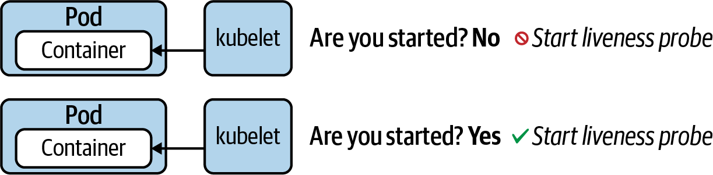

# Kubernetes

## Table of Contents

- [Generally Helpful Info](#generally-helpful-info)
  - [Get top 10 beginning lines](#get-top-10-beginning-lines)
  - [Streams tail end contents](#streams-tail-end-contents)
  - [Using an Alias for `kubectl`](#using-an-alias-for-kubectl)
  - [Get API Resource Short Names](#get-api-resource-short-names)
- [`config`](#config)
  - [Setting a Context and Namespace](#setting-a-context-and-namespace)
- [`top`](#top)
  - [Check node/pod memory & CPU usage](#check-nodepod-memory--cpu-usage)
- [`describe`](#describe)
  - [Listing of a series of events](#listing-of-a-series-of-events)
- [`explain`](#explain)
- [Explain a resource](#explain-a-resource)
  - [`grep` API documentation sections with a buffer of `n` containing "Probe"](#grep-api-documentation-sections-with-a-buffer-of-n-containing-probe)
- [`create`](#create)
  - [Get help on creatable resources](#get-help-on-creatable-resources)
- [`apply`](#apply)
  - [Create resources from file](#create-resources-from-file)
- [`delete`](#delete)
  - [Force kill/delete](#force-killdelete)
  - [Delete now](#delete-now)
- [`get`](#get)
  - [Get YAML manifest of existing resource](#get-yaml-manifest-of-existing-resource)
  - [Get all events for a given namespace](#get-all-events-for-a-given-namespace)
  - [Get events for an individual resource](#get-events-for-an-individual-resource)
  - [Get service endpoints](#get-service-endpoints)
  - [Get specific service endpoints](#get-specific-service-endpoints)
  - [Multiple resource types](#multiple-resource-types)
- [`set`](#set)
- [`label`](#label)
  - [Label Selection from the Command Line](#label-selection-from-the-command-line)
- [`annotate`](#annotate)
- [`rollout`](#rollout)
  - [Get detailed information about a revision](#get-detailed-information-about-a-revision)
  - [Rolling back to a previous revision](#rolling-back-to-a-previous-revision)
- [`scale`](#scale)
- [`autoscale`](#autoscale)
  - [Create a Horizontal Pod Autoscaler](#create-a-horizontal-pod-autoscaler)
- [`attach`](#attach)
  - [Get output from running pod](#get-output-from-running-pod)
  - [Get output from specific container in a pod](#get-output-from-specific-container-in-a-pod)
  - [Get output from the first pod of a replica set named nginx](#get-output-from-the-first-pod-of-a-replica-set-named-nginx)
- [`logs`](#logs)
  - [Get logs from a specific container](#get-logs-from-a-specific-container)
  - [Get logs from previously ran container](#get-logs-from-previously-ran-container)
  - [Stream logs](#stream-logs)
  - [Aggregated logs from all containers with a specifc label](#aggregated-logs-from-all-containers-with-a-specifc-label)
- [`expose`](#expose)
  - [Create yaml service manifest](#create-yaml-service-manifest)
- [`debug`](#debug)
  - [Create debug ephemeral container](#create-debug-ephemeral-container)
- [ConfigMap](#configmap)
  - [Creating a ConfigMap](#creating-a-configmap)
  - [Use ConfigMap in a Pod manifest via `envFrom.configMapRef`](#use-configmap-in-a-pod-manifest-via-envfromconfigmapref)
  - [Redefine keys from a ConfigMap](#redefine-keys-from-a-configmap)
  - [Mounting a ConfigMap as a Volume](#mounting-a-configmap-as-a-volume)
- [Secret](#secret)
  - [Creating a generic Secret](#creating-a-generic-secret)
  - [A Secret with Base64-encoded values](#a-secret-with-base64-encoded-values)
  - [Injecting key-value pairs of a Secret into a container](#injecting-key-value-pairs-of-a-secret-into-a-container)
  - [Mounting a Secret as a Volume](#mounting-a-secret-as-a-volume)
- [Security Context](#security-context)
  - [Setting a security context on the container level](#setting-a-security-context-on-the-container-level)
  - [Setting a security context on the Pod level](#setting-a-security-context-on-the-pod-level)
- [ResourceQuota](#resourcequota)
  - [Defining hard resource limits with ResourceQuota](#defining-hard-resource-limits-with-resourcequota)
  - [A Pod with resource requirements](#a-pod-with-resource-requirements)
- [Service Accounts](#service-accounts)
  - [Query for available Service Accounts](#query-for-available-service-accounts)
  - [Create a new Service Account](#create-a-new-service-account)
- [Multi-Container Pods](#multi-container-pods)
  - [A Pod defining an init Container](#a-pod-defining-an-init-container)
  - [The Sidecar Pattern](#the-sidecar-pattern)
  - [The Adapter Pattern](#the-adapter-pattern)
  - [The Amassador Pattern](#the-amassador-pattern)
- [Health Probes](#health-probes)
  - [Readiness Probe](#readiness-probe)
  - [Liveness Probe](#liveness-probe)
  - [Startup Probe](#startup-probe)
- [Jobs](#jobs)
  - [Restarting the Container on Failure](#restarting-the-container-on-failure)
  - [Starting a New Pod on Failure](#starting-a-new-pod-on-failure)
- [CronJobs](#cronjobs)
  - [Create CronJob](#create-cronjob)
  - [A CronJob printing the current date](#a-cronjob-printing-the-current-date)
- [Services & Networking](#services--networking)
  - [Service Types](#service-types)
  - [Creating Services](#creating-services)
  - [Port Mapping](#port-mapping)
  - [Accessing a Service with Type ClusterIP](#accessing-a-service-with-type-clusterip)
  - [Accessing a Service with Type NodePort](#accessing-a-service-with-type-nodeport)
  - [Deployments and Services](#deployments-and-services)
  - [Understanding Network Policies](#understanding-network-policies)
  - [Creating Network Policies](#creating-network-policies)
  - [Isolating All Pods in a Namespace](#isolating-all-pods-in-a-namespace)
  - [Restrict Acces to Ports](#restrict-acces-to-ports)
- [State Persistence](#state-persistence)
  - [Understanding Volumes](#understanding-volumes)
  - [Volume Types](#volume-types)
  - [Creating and Accessing Volumes](#creating-and-accessing-volumes)
  - [Understanding Persistent Volumes](#understanding-persistent-volumes)
  - [Static Versus Dynamic Provisioning](#static-versus-dynamic-provisioning)
  - [Creating PersistentVolumes](#creating-persistentvolumes)
  - [Creating PersistentVolumeClaims](#creating-persistentvolumeclaims)
  - [Mounting PersistentVolumeClaims in a Pod](#mounting-persistentvolumeclaims-in-a-pod)

## Generally Helpful Info

### Get top 10 beginning lines

```sh
head -n 10 [file]
```

### Streams tail end contents

```sh
tail -f [file]
```

> Last 5 lines

```sh
kubectl describe pod [pod] | tail -n 5
```

### Using an Alias for `kubectl`

```sh
alias k=kubectl
k version
```

### Get API Resource Short Names

```sh
$ kubectl api-resources
NAME                    SHORTNAMES  APIGROUP  NAMESPACED  KIND
...
persistentvolumeclaims  pvc                   true        PersistentVolumeClaim
...
```

## `config`

### Setting a Context and Namespace

```sh
kubectl config set-context <context-of-question> \
  --namespace=<namespace-of-question>
```

## `top`

> NOTE: [Metrics server](https://github.com/kubernetes-sigs/metrics-server) must be enabled to use `top`

### Check node/pod memory & CPU usage

```sh
kubectl top nodes
kubectl top pods
```

## `describe`

### Listing of a series of events

```sh
$ kubectl describe pod/non-root
...
Events:
Type     Reason     Age              From               Message
----     ------     ----             ----               -------
Normal   Scheduled  <unknown>        default-scheduler  Successfully assigned \
                                                        default/non-root to minikube
Normal   Pulling    18s              kubelet, minikube  Pulling image "nginx:1.18.0"
Normal   Pulled     14s              kubelet, minikube  Successfully pulled image \
                                                        "nginx:1.18.0"
Warning  Failed     0s (x3 over 14s) kubelet, minikube  Error: container has \
                                                        runAsNonRoot and image \
                                                        will run as root
```

## `explain`

## Explain a resource

```sh
$ kubectl explain pods.spec
KIND:     Pod
VERSION:  v1

RESOURCE: spec <Object>

DESCRIPTION:
  ...

FIELDS:
  ...
```

### `grep` API documentation sections with a buffer of `n` containing "Probe"

```sh
$ kubectl explain pods.spec.containers | grep -C 4 Probe
   lifecycle <Object>
     Actions that the management system should take in response to container
     lifecycle events. Cannot be updated.

   livenessProbe <Object>
     Periodic probe of container liveness. Container will be restarted if the
     probe fails. Cannot be updated. More info:
     https://kubernetes.io/docs/concepts/workloads/pods/pod-lifecycle#container-probes

--
     prevent that port from being exposed. Any port which is listening on the
     default "0.0.0.0" address inside a container will be accessible from the
     network. Cannot be updated.

   readinessProbe <Object>
     Periodic probe of container service readiness. Container will be removed
     from service endpoints if the probe fails. Cannot be updated. More info:
     https://kubernetes.io/docs/concepts/workloads/pods/pod-lifecycle#container-probes

--
     with. If set, the fields of SecurityContext override the equivalent fields
     of PodSecurityContext. More info:
     https://kubernetes.io/docs/tasks/configure-pod-container/security-context/

   startupProbe <Object>
     StartupProbe indicates that the Pod has successfully initialized. If
     specified, no other probes are executed until this completes successfully.
     If this probe fails, the Pod will be restarted, just as if the
     livenessProbe failed. This can be used to provide different probe
     parameters at the beginning of a Pod's lifecycle, when it might take a long
     time to load data or warm a cache, than during steady-state operation. This
     cannot be updated. More info:
     https://kubernetes.io/docs/concepts/workloads/pods/pod-lifecycle#container-probes
```

## `create`

### Get help on creatable resources

```sh
$ kubectl create --help
Create a resource from a file or from stdin.

JSON and YAML formats are accepted.

Examples:
  ...

Available Commands:
  ...

Options:
  ...
```

## `apply`

> Stateful/Declarative approach compared to imperative `create` command unless the equivalent `kubectl create -f [file] --save-config` is ran.

### Create resources from file

```sh
kubectl apply -f [file]
```

## `delete`

### Force kill/delete

> Use the command line option --grace-period=0 and --force to send a SIGKILL signal. The signal will delete a Kubernetes object immediately

```sh
kubectl delete [resource] [name] --grace-period=0 --force
```

### Delete now

```sh
kubectl delete [resource] [name] --now
```

## `get`

### Get YAML manifest of existing resource

```sh
kubectl get [resource] [name] -o yaml > manifest.yaml
```

### Get all events for a given namespace

```sh
kubectl get events
```

### Get events for an individual resource

```sh
kubectl get events --field-selector=involvedObject.name=[object name]
```

### Get service endpoints

```sh
$ kubectl get endpoints
NAME         ENDPOINTS           AGE
kubernetes   192.168.65.4:6443   15d
mylb         10.1.0.42:80        5m5s
```

### Get specific service endpoints

```sh
$ kubectl get endpoints myservice
NAME        ENDPOINTS                     AGE
myservice   172.17.0.5:80,172.17.0.6:80   9m31s
```

### Multiple resource types

```sh
kubectl get statefulsets,services --all-namespaces --field-selector metadata.namespace!=default
```

## `set`

- `env`             -- Update environment variables on a pod template
  - `kubectl set env [resource] [name] [key]=[value]`
- `image`           -- Update the image of a pod template
  - `kubectl set image [resource] [name] [container name]=[image name]`
  - example: `kubectl set image deployment my-deploy nginx=nginx:1.19.2`
- `resources`       -- Update resource requests/limits on objects with pod templates
- `selector`        -- Set the selector on a resource
- `serviceaccount`  -- Update the service account of a resource
- `subject`         -- Update the user, group, or service account in a role binding or cluster role binding

## `label`

```sh
$ kubectl label pod labeled-pod region=eu
pod/labeled-pod labeled
$ kubectl get pod labeled-pod --show-labels
NAME          READY   STATUS    RESTARTS   AGE   LABELS
labeled-pod   1/1     Running   0          22h   env=dev,region=eu,tier=backend
$ kubectl label pod labeled-pod region=us --overwrite
pod/labeled-pod labeled
$ kubectl get pod labeled-pod --show-labels
NAME          READY   STATUS    RESTARTS   AGE   LABELS
labeled-pod   1/1     Running   0          22h   env=dev,region=us,tier=backend
$ kubectl label pod labeled-pod region-
pod/labeled-pod labeled
$ kubectl get pod labeled-pod --show-labels
NAME          READY   STATUS    RESTARTS   AGE   LABELS
labeled-pod   1/1     Running   0          22h   env=dev,tier=backend
```

### Label Selection from the Command Line

> An equality-based requirement can use the operators`=`, `==`, or `!=`.

> A set-based requirement can filter objects based on a set of values using the operators `in`, `notin`, and `exists`.

```sh
$ kubectl get pods -l env=prod --show-labels
NAME       READY   STATUS    RESTARTS   AGE   LABELS
backend    1/1     Running   0          37s   app=v1.2.4,env=prod,team=legacy
database   1/1     Running   0          32s   env=prod,team=storage
frontend   1/1     Running   0          42s   env=prod,team=shiny
```

> Get pods where label team is qual to shiny OR legacy

```sh
$ kubectl get pods -l 'team in (shiny, legacy)' --show-labels
NAME       READY   STATUS    RESTARTS   AGE   LABELS
backend    1/1     Running   0          19m   app=v1.2.4,env=prod,team=legacy
frontend   1/1     Running   0          20m   env=prod,team=shiny
```

> Get pods where label team is equal to shiny OR legacy AND app is equal to v1.2.4

```sh
$ kubectl get pods -l 'team in (shiny, legacy)',app=v1.2.4 --show-labels
NAME      READY   STATUS    RESTARTS   AGE   LABELS
backend   1/1     Running   0          29m   app=v1.2.4,env=prod,team=legacy
```

## `annotate`

> The `annotate` command is the counterpart of the `label` command but for annotations.

```sh
$ kubectl annotate pod annotated-pod oncall='800-555-1212'
pod/annotated-pod annotated
$ kubectl annotate pod annotated-pod oncall='800-555-2000' --overwrite
pod/annotated-pod annotated
$ kubectl annotate pod annotated-pod oncall-
pod/annotated-pod annotated
```

## `rollout`

- `history`  -- View rollout history
- `pause`    -- Mark the provided resource as paused
- `restart`  -- Restart a resource
- `resume`   -- Resume a paused resource
- `status`   -- Show the status of the rollout
- `undo`     -- Undo a previous rollout

> Every Deployment keeps a record of the rollout history. By default, a Deployment persists a maximum of 10 revisions in its history. You can change the limit by assigning a different value to spec.revisionHistoryLimit.

### Get detailed information about a revision

```sh
$ kubectl rollout history deployments my-deploy --revision=2
deployment.apps/my-deploy with revision #2
Pod Template:
  Labels: app=my-deploy
 pod-template-hash=9df7d9c6
  Containers:
   nginx:
    Image: nginx:1.19.2
    Port: <none>
    Host Port: <none>
    Environment: <none>
    Mounts: <none>
  Volumes: <none>
```

### Rolling back to a previous revision

```sh
$ kubectl rollout undo deployment my-deploy --to-revision=1
deployment.apps/my-deploy rolled back
```

## `scale`

> Set a new size for a deployment, replica set, or a replication controller

```sh
$ kubectl scale deployment my-deploy --replicas=5
deployment.apps/my-deploy scaled
$ kubectl get pods
NAME                         READY   STATUS              RESTARTS   AGE
my-deploy-8448c488b5-5f5tg   0/1     ContainerCreating   0          4s
my-deploy-8448c488b5-9xplx   0/1     ContainerCreating   0          4s
my-deploy-8448c488b5-d8q4t   0/1     ContainerCreating   0          4s
my-deploy-8448c488b5-f5kkm   0/1     ContainerCreating   0          4s
my-deploy-8448c488b5-mzx5g   1/1     Running             0          3d19h
$ kubectl get pods
NAME                         READY   STATUS    RESTARTS   AGE
my-deploy-8448c488b5-5f5tg   1/1     Running   0          44s
my-deploy-8448c488b5-9xplx   1/1     Running   0          44s
my-deploy-8448c488b5-d8q4t   1/1     Running   0          44s
my-deploy-8448c488b5-f5kkm   1/1     Running   0          44s
my-deploy-8448c488b5-mzx5g   1/1     Running   0          3d19h
$ kubectl get replicasets
NAME                   DESIRED   CURRENT   READY   AGE
my-deploy-8448c488b5   5         5         5       3d19h
```

## `autoscale`

> NOTE: [Metrics server](https://github.com/kubernetes-sigs/metrics-server) must be enabled for scaling to work properly.

### Create a Horizontal Pod Autoscaler

```sh
$ kubectl autoscale deployment my-deploy --cpu-percent=70 --min=2 --max=8
horizontalpodautoscaler.autoscaling/my-deploy autoscaled
$ kubectl get hpa
NAME        REFERENCE             TARGETS        MINPODS  MAXPODS REPLICAS  AGE
my-deploy   Deployment/my-deploy  <unknown>/70%  2        8       2         37s
```

## `attach`

### Get output from running pod

```sh
# Get output from running pod mypod; use the 'kubectl.kubernetes.io/default-container' annotation
# for selecting the container to be attached or the first container in the pod will be chosen
kubectl attach mypod
```

### Get output from specific container in a pod

```sh
# Get output from ruby-container from pod mypod
kubectl attach mypod -c ruby-container

# Switch to raw terminal mode; sends stdin to 'bash' in ruby-container from pod mypod
# and sends stdout/stderr from 'bash' back to the client
kubectl attach mypod -c ruby-container -i -t
```

### Get output from the first pod of a replica set named nginx

```sh
kubectl attach rs/nginx
```

## `logs`

### Get logs from a specific container

```sh
kubectl logs business-app -c configurer
```

### Get logs from previously ran container

```sh
kubectl logs [resource]/[pod] -p
```

### Stream logs

```sh
kubectl logs [resource]/[pod] -f
```

### Aggregated logs from all containers with a specifc label

```sh
kubectl logs --selector=[label]
kubectl logs --selector=app=my-app
```

## `expose`

The `expose` command and the `--expose` command-line option are welcome shortcuts as a means to creating a new Service with a fast turnaround time.

> For an existing Deployment, you can expose the underlying Pods with a Service using the expose deployment command:

```sh
$ kubectl expose deployment my-deploy --port=80 --target-port=80
service/my-deploy exposed
```

### Create yaml service manifest

```sh
kubectl expose pod my-pod --name=my-service --port=8080 --target-port=80 \
  --selector=app=web,tier=backend -o yaml --dry-run=client > my-service.yaml
```

## `debug`

> NOTE: Ephemeral containers are still considered an experimental feature. The cluster has to enable the feature flag to work.

- [Ephemeral Containers](https://kubernetes.io/docs/concepts/workloads/pods/ephemeral-containers/)
- [Debugging with an ephemeral debug container](https://kubernetes.io/docs/tasks/debug-application-cluster/debug-running-pod/#ephemeral-container)

### Create debug ephemeral container

> If you specify the `-i`/`--interactive` argument, `kubectl` will automatically attach to the console of the Ephemeral Container.

```sh
kubectl debug [pod] -it --image=busybox
```

## ConfigMap

### Creating a ConfigMap

#### *Create a new config map named my-config based on folder bar*

```sh
kubectl create configmap my-config --from-file=path/to/bar
```

#### *Create a new config map named my-config with specified keys instead of file basenames on disk*

```sh
kubectl create configmap my-config --from-file=key1=/path/to/bar/file1.txt --from-file=key2=/path/to/bar/file2.txt
```

#### *Create a new config map named my-config with key1=config1 and key2=config2*

```sh
kubectl create configmap my-config --from-literal=key1=config1 --from-literal=key2=config2
```

#### *Create a new config map named my-config from the key=value pairs in the file*

```sh
kubectl create configmap my-config --from-file=path/to/bar
```

#### *Create a new config map named my-config from an env file*

```sh
kubectl create configmap my-config --from-env-file=path/to/foo.env --from-env-file=path/to/bar.env
```

### Use ConfigMap in a Pod manifest via `envFrom.configMapRef`

```yaml
apiVersion: v1
kind: Pod
metadata:
  name: configured-pod
spec:
  containers:
  - image: nginx:1.19.0
    name: app
    envFrom:
    - configMapRef:
        name: backend-config
```

### Redefine keys from a ConfigMap

```yaml
apiVersion: v1
kind: Pod
metadata:
  name: configured-pod
spec:
  containers:
  - image: nginx:1.19.0
    name: app
    env:
    - name: DATABASE_URL
      valueFrom:
        configMapKeyRef:
          name: backend-config
          key: database_url
    - name: USERNAME
      valueFrom:
        configMapKeyRef:
          name: backend-config
          key: user
```

### Mounting a ConfigMap as a Volume

```yaml
apiVersion: v1
kind: Pod
metadata:
  name: configured-pod
spec:
  containers:
  - image: nginx:1.19.0
    name: app
    volumeMounts:
    - name: config-volume
      mountPath: /etc/config
  volumes:
  - name: config-volume
    configMap:
      name: backend-config
```

```sh
$ kubectl exec -it configured-pod -- /bin/sh
# ls -1 /etc/config
database_url
user
# cat /etc/config/database_url
jdbc:postgresql://localhost/test
# cat /etc/config/user
fred
```

## Secret

> If you create secrets imperitively then kubernetes will automatically base64 encode your secret. Conversely if you create secrets declaritively then you must base64 encode the secret when in most cases.

### Creating a generic Secret

#### *Literal Values*

```sh
kubectl create secret generic db-creds --from-literal=pwd=s3cre!
```

#### *File containing environment variables*

```sh
kubectl create secret generic db-creds --from-env-file=secret.env
```

#### *SSH key file*

```sh
kubectl create secret generic ssh-key --from-file=id_rsa=~/.ssh/id_rsa
```

### A Secret with Base64-encoded values

> You have to Base64-encode the configuration data value yourself when using the type `Opaque`.

```sh
$ echo -n 's3cre!' | base64
czNjcmUh
````

```yaml
apiVersion: v1
kind: Secret
metadata:
  name: db-creds
type: Opaque
data:
  pwd: czNjcmUh
```

### Injecting key-value pairs of a Secret into a container

> It’s important to understand that the container will make the environment variable available in a Base64-decoded value. In turn, your application running in the container will not have to implement Base64-decoding logic

```yaml
apiVersion: v1
kind: Pod
metadata:
  name: configured-pod
spec:
  containers:
  - image: nginx:1.19.0
    name: app
    envFrom:
    - secretRef:
        name: db-creds
```

### Mounting a Secret as a Volume

> Secrets mounted as Volume will expose its values in Base64-decoded form.

```yaml
apiVersion: v1
kind: Pod
metadata:
  name: configured-pod
spec:
  containers:
  - image: nginx:1.19.0
    name: app
    volumeMounts:
    - name: secret-volume
      mountPath: /var/app
      readOnly: true
  volumes:
  - name: secret-volume
    secret:
      secretName: ssh-key
```

## Security Context

A security context defines privilege and access control settings for a Pod or a container.

- The user ID that should be used to run the Pod and/or container.
- The group ID that should be used for filesystem access.
- Granting a running process inside the container some privileges of the root user but not all of them.

The security context is not a Kubernetes primitive. It is modeled as a set of attributes under the directive `securityContext` within the Pod specification. Security settings defined on the Pod level apply to all containers running in the Pod; **however, container-level settings take precidence.**

### Setting a security context on the container level

```yaml
apiVersion: v1
kind: Pod
metadata:
  name: non-root
spec:
  containers:
  - image: bitnami/nginx:1.18.0
    name: secured-container
    securityContext:
      runAsNonRoot: true
```

> NOTE: can fail if the container image was setup to require root user access

```sh
$ kubectl describe pod/non-root
...
Events:
Type     Reason     Age              From               Message
----     ------     ----             ----               -------
Normal   Scheduled  <unknown>        default-scheduler  Successfully assigned \
                                                        default/non-root to minikube
Normal   Pulling    18s              kubelet, minikube  Pulling image "nginx:1.18.0"
Normal   Pulled     14s              kubelet, minikube  Successfully pulled image \
                                                        "nginx:1.18.0"
Warning  Failed     0s (x3 over 14s) kubelet, minikube  Error: container has \
                                                        runAsNonRoot and image \
                                                        will run as root
```

### Setting a security context on the Pod level

> Whenever a file is created on the filesystem, the owner of the file will be the arbitrary group ID 3500

```yaml
apiVersion: v1
kind: Pod
metadata:
  name: fs-secured
spec:
  securityContext:
    fsGroup: 3500
  containers:
  - image: bitnami/nginx:1.18.0
    name: secured-container
    volumeMounts:
    - name: data-volume
      mountPath: /data/app
  volumes:
  - name: data-volume
    emptyDir: {}
```

## ResourceQuota

The Kubernetes primitive ResourceQuota establishes the usable, maximum amount of resources per namespace.

- Setting an upper limit for the number of objects that can be created for a specific type (e.g., a maximum of 3 Pods).
- Limiting the total sum of compute resources (e.g., 3 GiB of RAM).
- Expecting a Quality of Service (QoS) class for a Pod (e.g., `BestEffort` to indicate that the Pod must not make any memory or CPU limits or requests).

<https://kubernetes.io/docs/concepts/configuration/manage-resources-containers/#resource-units-in-kubernetes>

### Defining hard resource limits with ResourceQuota

> Because we defined minimum and maximum resource requirements for objects in the namespace, we’ll have to ensure that the YAML manifest actually defines them.

```yaml
apiVersion: v1
kind: ResourceQuota
metadata:
  name: awesome-quota
spec:
  hard:
    pods: 2
    requests.cpu: "1"
    requests.memory: 1024m
    limits.cpu: "4"
    limits.memory: 4096m
```

```sh
$ kubectl create -f awesome-quota.yaml --namespace=team-awesome
resourcequota/awesome-quota created
$ kubectl describe resourcequota awesome-quota --namespace=team-awesome
Name:            awesome-quota
Namespace:       team-awesome
Resource         Used  Hard
--------         ----  ----
limits.cpu       0     4
limits.memory    0     4096m
pods             0     2
requests.cpu     0     1
requests.memory  0     1024m
```

### A Pod with resource requirements

```yaml
apiVersion: v1
kind: Pod
metadata:
  name: nginx
spec:
  containers:
  - image: nginx:1.18.0
    name: nginx
    resources:
      requests:
        cpu: "0.5"
        memory: "512m"
      limits:
        cpu: "1"
        memory: "1024m"
```

## Service Accounts

Pods use a Service Account to authenticate with the API server through an authentication token. A Kubernetes administrator assigns rules to a Service Account via role-based access control (RBAC) to authorize access to specific resources and actions.

**If not assigned explicitly, a Pod uses the default Service Account. The default Service Account has the same permissions as an unauthenticated user. This means that the Pod cannot view or modify the cluster state nor list or modify any of its resources.**

<https://kubernetes.io/docs/reference/access-authn-authz/rbac/>

### Query for available Service Accounts

```sh
$ kubectl get serviceaccounts
NAME      SECRETS   AGE
default   1         25d
```

> Kubernetes models the authentication token with the Secret primitive. It’s easy to identify the corresponding Secret for a Service Account. Retrieve the YAML representation of the Service Account and look at the attribute secrets. In the Secret, you can find the Base64-encoded values of the current namespace, the cluster certificate, and the authentication token:

```sh
$ kubectl get serviceaccount default -o yaml | grep -A 1 secrets:
secrets:
- name: default-token-bf8rh
$ kubectl get secret default-token-bf8rh -o yaml
apiVersion: v1
data:
  ca.crt: LS0tLS1CRUdJTiB...0FURS0tLS0tCg==
  namespace: ZGVmYXVsdA==
  token: ZXlKaGJHY2lPaUp...ThzU0poeFMxR013
kind: Secret
...
```

### Create a new Service Account

```sh
kubectl create serviceaccount [name]
```

> There are two ways to assign the Service Account to a Pod. You can either edit the YAML manifest and add the serviceAccountName attribute as shown above, or you can use the --serviceaccount flag in conjunction with the run command when creating the Pod

```sh
$ kubectl run nginx --image=nginx --restart=Never --serviceaccount=custom
pod/nginx created
$ kubectl get pod nginx -o yaml
apiVersion: v1
kind: Pod
metadata:
  ...
spec:
  serviceAccountName: custom
...
```

## Multi-Container Pods

> The default restart policy of a Pod is Always, which tells the Kubernetes scheduler to always restart the Pod even if the container exits with a zero exit code.

### A Pod defining an init Container

> If an init container produces an error, the whole Pod is restarted, causing all init containers to run again in sequential order. For init containers, Kubernetes provides a separate section: spec.initContainers. Init containers are always executed before the main application containers, regardless of the definition order in the manifest.

```yaml
apiVersion: v1
kind: Pod
metadata:
  name: business-app
spec:
  initContainers:
  - name: configurer
    image: busybox:1.32.0
    command: ['sh', '-c', 'echo Configuring application... && \
              mkdir -p /usr/shared/app && echo -e "{\"dbConfig\": \
              {\"host\":\"localhost\",\"port\":5432,\"dbName\":\"customers\"}}" \
              > /usr/shared/app/config.json']
    volumeMounts:
    - name: configdir
      mountPath: "/usr/shared/app"
  containers:
  - image: bmuschko/nodejs-read-config:1.0.0
    name: web
    ports:
    - containerPort: 8080
    volumeMounts:
    - name: configdir
      mountPath: "/usr/shared/app"
  volumes:
  - name: configdir
    emptyDir: {}
```

### The Sidecar Pattern

Common use cases:

- Synchronization
- Logging
- Watcher

> The sidecars are not part of the main traffic or API of the primary application. They usually operate asynchronously and are not involved in the public API.


#### An exemplary sidecar pattern implementation

```yaml
apiVersion: v1
kind: Pod
metadata:
  name: webserver
spec:
  containers:
  - name: nginx
    image: nginx
    volumeMounts:
    - name: logs-vol
      mountPath: /var/log/nginx
  - name: sidecar
    image: busybox
    command: ["sh","-c","while true; do if [ \"$(cat /var/log/nginx/error.log \
              | grep 'error')\" != \"\" ]; then echo 'Error discovered!'; fi; \
              sleep 10; done"]
    volumeMounts:
    - name: logs-vol
      mountPath: /var/log/nginx
  volumes:
  - name: logs-vol
    emptyDir: {}
```

### The Adapter Pattern

> The adapter pattern transforms the output produced by the application to make it consumable in the format needed by another part of the system.


#### An exemplary adapter pattern implementation

```yaml
apiVersion: v1
kind: Pod
metadata:
  name: adapter
spec:
  containers:
  - args:
    - /bin/sh
    - -c
    - 'while true; do echo "$(date) | $(du -sh ~)" >> /var/logs/diskspace.txt; \
       sleep 5; done;'
    image: busybox
    name: app
    volumeMounts:
      - name: config-volume
        mountPath: /var/logs
  - image: busybox
    name: transformer
    args:
    - /bin/sh
    - -c
    - 'sleep 20; while true; do while read LINE; do echo "$LINE" | cut -f2 -d"|" \
       >> $(date +%Y-%m-%d-%H-%M-%S)-transformed.txt; done < \
       /var/logs/diskspace.txt; sleep 20; done;'
    volumeMounts:
    - name: config-volume
      mountPath: /var/logs
  volumes:
  - name: config-volume
    emptyDir: {}
```

### The Amassador Pattern

The ambassador pattern provides a proxy for communicating with external services.

The overarching goal is to hide and/or abstract the complexity of interacting with other parts of the system.

Typical responsibilities include retry logic upon a request failure, security concerns like providing authentication or authorization, or monitoring latency or resource usage.


#### Node.js HTTP rate limiter implementation

> For example, the requirements for the rate limiter could say that an application can only make a maximum of 5 calls every 15 minutes. Instead of strongly coupling the rate-limiting logic to the application code, it will be provided by an ambassador container. Any calls made from the business application need to be funneled through the ambassador container.

```javascript
const express = require('express');
const app = express();
const rateLimit = require('express-rate-limit');
const https = require('https');

const rateLimiter = rateLimit({
  windowMs: 15 * 60 * 1000,
  max: 5,
  message:
    'Too many requests have been made from this IP, please try again after an hour'
});

app.get('/test', rateLimiter, function (req, res) {
  console.log('Received request...');
  var id = req.query.id;
  var url = 'https://postman-echo.com/get?test=' + id;
  console.log("Calling URL %s", url);

  https.get(url, (resp) => {
    let data = '';

    resp.on('data', (chunk) => {
      data += chunk;
    });

    resp.on('end', () => {
      res.send(data);
    });

    }).on("error", (err) => {
      res.send(err.message);
    });
})

var server = app.listen(8081, function () {
  var port = server.address().port
  console.log("Ambassador listening on port %s...", port)
})
```

#### An exemplary ambassador pattern implementation

```yaml
apiVersion: v1
kind: Pod
metadata:
  name: rate-limiter
spec:
  containers:
  - name: business-app
    image: bmuschko/nodejs-business-app:1.0.0
    ports:
    - containerPort: 8080
  - name: ambassador
    image: bmuschko/nodejs-ambassador:1.0.0
    ports:
    - containerPort: 8081
```

```sh
$ kubectl create -f ambassador.yaml
pod/rate-limiter created
$ kubectl get pods rate-limiter
NAME           READY   STATUS    RESTARTS   AGE
rate-limiter   2/2     Running   0          5s
$ kubectl exec rate-limiter -it -c business-app -- /bin/sh
# curl localhost:8080/test
{"args":{"test":"123"},"headers":{"x-forwarded-proto":"https", \
"x-forwarded-port":"443","host":"postman-echo.com", \
"x-amzn-trace-id":"Root=1-5f177dba-e736991e882d12fcffd23f34"}, \
"url":"https://postman-echo.com/get?test=123"}
...
# curl localhost:8080/test
Too many requests have been made from this IP, please try again after an hour
```

## Health Probes

Each probe offers three distinct methods to verify the health of a container. You can define one or many of the health verification methods for a container.

| Method | Option | Description |
| :-: | :-: | :- |
|Custom command|`exec.command`|Executes a command inside of the container (e.g., a `cat` command) and checks its exit code. Kubernetes considers a zero exit code to be successful. A non-zero exit code indicates an error.|
|HTTP GET request|`httpGet`|Sends an HTTP GET request to an endpoint exposed by the application. An HTTP response code in the range of 200 and 399 indicates success. Any other response code is regarded as an error.|
|TCP socket connection|`tcpSocket`|Tries to open a TCP socket connection to a port. If the connection could be established, the probing attempt was successful. The inability to connect is accounted for as an error.|

Every probe offers a set of attributes that can further configure the runtime behavior

|Attribute|Default value|Description|
| :-: | :-: | :- |
|`initialDelaySeconds`|0|Delay in seconds until first check is executed.|
|`periodSeconds`|10|Interval for executing a check (e.g., every 20 seconds).|
|`timeoutSeconds`|1|Maximum number of seconds until check operation times out.|
|`successThreshold`|1|Number of successful check attempts until probe is considered successful after a failure.|
|`failureThreshold`|3|Number of failures for check attempts before probe is marked failed and takes action.|

### Readiness Probe

>Even after an application has been started up, it may still need to execute configuration procedures—for example, connecting to a database and preparing data. This probe checks if the application is ready to serve incoming requests.


#### A readiness probe that uses an HTTP GET request

```yaml
apiVersion: v1
kind: Pod
metadata:
  name: readiness-pod
spec:
  containers:
  - image: bmuschko/nodejs-hello-world:1.0.0
    name: hello-world
    ports:
    - name: nodejs-port
      containerPort: 3000
    readinessProbe:
      httpGet:
        path: /
        port: nodejs-port
      initialDelaySeconds: 2
      periodSeconds: 8
```

### Liveness Probe

> Once the application is running, we’ll want to make sure that it still works as expected without issues. This probe periodically checks for the application’s responsiveness. Kubernetes restarts the Pod automatically if the probe considers the application be in an unhealthy state.


#### A liveness probe that uses a custom command

```yaml
apiVersion: v1
kind: Pod
metadata:
  name: liveness-pod
spec:
  containers:
  - image: busybox
    name: app
    args:
    - /bin/sh
    - -c
    - 'while true; do touch /tmp/heartbeat.txt; sleep 5; done;'
    livenessProbe:
      exec:
        command:
        - test `find /tmp/heartbeat.txt -mmin -1`
      initialDelaySeconds: 5
      periodSeconds: 30
```

### Startup Probe

> Legacy applications in particular can take a long time to start up—we’re talking minutes sometimes. This probe can be instantiated to wait for a predefined amount of time before a liveness probe is allowed to start probing. By setting up a startup probe, you can prevent overwhelming the application process with probing requests. Startup probes kill the container if the application couldn’t start within the set time frame.

The kubelet puts the readiness and liveness probes on hold while the startup probe is running. A startup probe finishes its operation under one of the following conditions:

- If it could verify that the application has been started.
- If the application doesn't respond within the timeout period.



#### A startup probe that uses a TCP socket connection

```yaml
apiVersion: v1
kind: Pod
metadata:
  name: startup-pod
spec:
  containers:
  - image: httpd:2.4.46
    name: http-server
    startupProbe:
      tcpSocket:
        port: 80
      initialDelaySeconds: 3
      periodSeconds: 15
```

## Jobs

> The `spec.backoffLimit` attribute determines the number of retries a Job attempts to successfully complete the workload until the executed command finishes with an exit code 0. The default is 6, which means it will execute the workload 6 times before the Job is considered unsuccessful.

### Restarting the Container on Failure

> `OnFailure`: Upon a container failure, this policy will simply rerun the container.


### Starting a New Pod on Failure

> `Never`: This policy does not restart the container upon a failure. It starts a new Pod instead.


## CronJobs

> A CronJob is essentially a Job, but it’s run periodically based a schedule; however, it will continue to create a new Pod when it’s time to run the task. The schedule can be defined with a cron-expression you may already know from Unix cron jobs.


> By default, a CronJob retains the last three successful Pods and the last failed Pod

```sh
$ kubectl get cronjobs current-date -o yaml | grep successfulJobsHistoryLimit:
  successfulJobsHistoryLimit: 3
$ kubectl get cronjobs current-date -o yaml | grep failedJobsHistoryLimit:
  failedJobsHistoryLimit: 1
```

### Create CronJob

```sh
$ kubectl create cronjob current-date --schedule="* * * * *" --image=nginx \
  -- /bin/sh -c 'echo "Current date: $(date)"'
cronjob.batch/current-date created
```

### A CronJob printing the current date

```yaml
apiVersion: batch/v1beta1
kind: CronJob
metadata:
  name: current-date
spec:
  schedule: "* * * * *"
  jobTemplate:
    spec:
      template:
        spec:
          containers:
          - name: current-date
            image: nginx
            args:
            - /bin/sh
            - -c
            - 'echo "Current date: $(date)"'
          restartPolicy: OnFailure
```
## Services & Networking

### Service Types

| Type | Description |
| :-: | :- |
|`ClusterIP`|Exposes the Service on a cluster-internal IP. Only reachable from within the cluster.|
|`NodePort`|Exposes the Service on each node's IP address at a static port. Accessible from outside of the cluster.|
|`LoadBalancer`|Exposes the Service externally using a cloud provider's load balancer.|
|`ExternalName`|Maps a Service to a DNS name|

### Creating Services

#### Creating a service imperatively

```sh
# kubectl create service [type] [name] [options]
$ kubectl create service clusterip nginx-service --tcp=80:80
service/nginx-service created
```

#### `--expose` command line option

> Instead of creating a Service as a standalone object, you can also expose a Pod or Deployment with a single command. The run command provides an optional --expose command-line option, which creates a new Pod and a corresponding Service with the correct label selection in place:

```sh
$ kubectl run nginx --image=nginx --restart=Never --port=80 --expose
service/nginx created
pod/nginx created
```

```sh
$ kubectl expose deployment my-deploy --port=80 --target-port=80
service/my-deploy exposed
```

### Port Mapping

The correct port mapping determines if the incoming traffic actually reaches the application running inside of the Pods that match the label selection criteria of the Service. A Service always defines two different ports: the incoming port accepting traffic and the outgoing port, also called the target port.

> The figure below shows a Service that accepts incoming traffic on port 3000. That’s the port defined by the attribute ports.port in the manifest. Any incoming traffic is then routed toward the target port, represented by ports.targetPort. The target port is the same port as defined by the container running inside of the label-selected Pod. In this case, that’s port 80.


### Accessing a Service with Type ClusterIP

`ClusterIP` is the default type of Service. It exposes the Service on a cluster-internal IP address. Figure below shows how to reach a Pod exposed by the `ClusterIP` type from another Pod from within the cluster. You can also create a proxy from outside of the cluster using the `kubectl proxy` command.


```sh
$ kubectl run nginx --image=nginx --restart=Never --port=80 --expose
service/nginx created
pod/nginx created
$ kubectl get pod,service
NAME        READY   STATUS    RESTARTS   AGE
pod/nginx   1/1     Running   0          26s

NAME            TYPE        CLUSTER-IP      EXTERNAL-IP   PORT(S)   AGE
service/nginx   ClusterIP   10.96.225.204   <none>        80/TCP    26s
```

Remember that the Service of type ClusterIP can only be reached from within the cluster. To demonstrate the behavior, we’ll create a new Pod running in the same cluster and execute a wget command to access the application. Have a look at the cluster IP exposed by the Service—that’s 10.96.225.204. The port is 80. Combined as a single command, you can resolve the application via wget -O- 10.96.225.204:80 from the temporary Pod:

```sh
$ kubectl run busybox --image=busybox --restart=Never -it -- /bin/sh
Connecting to 10.96.225.204:80 (10.96.225.204:80)
writing to stdout
<!DOCTYPE html>
<html>
<head>
<title>Welcome to nginx!</title>
<style>
    body {
        width: 35em;
        margin: 0 auto;
        font-family: Tahoma, Verdana, Arial, sans-serif;
    }
</style>
</head>
<body>
<h1>Welcome to nginx!</h1>
<p>If you see this page, the nginx web server is successfully installed and \
working. Further configuration is required.</p>

<p>For online documentation and support please refer to
<a href="http://nginx.org/">nginx.org</a>.<br/>
Commercial support is available at
<a href="http://nginx.com/">nginx.com</a>.</p>

<p><em>Thank you for using nginx.</em></p>
</body>
</html>
-                    100% |************************************************ \
**********************|   612  0:00:00 ETA
written to stdout
/ # exit
```

The `proxy` command can establish a direct connection to the Kubernetes API server from your localhost. With the following command, we are opening port 9999 on which to run the proxy:

```sh
$ kubectl proxy --port=9999
Starting to serve on 127.0.0.1:9999
```

Say you have the curl command-line tool installed on your machine to make a call to an endpoint of the API server. The following example uses localhost:9999—that’s the proxy entry point. As part of the URL, you’re providing the endpoint to the Service named nginx running in the default namespace according to the [API reference](https://kubernetes.io/docs/reference/using-api/):

```sh
$ curl -L localhost:9999/api/v1/namespaces/default/services/nginx/proxy
<!DOCTYPE html>
<html>
<head>
<title>Welcome to nginx!</title>
<style>
    body {
        width: 35em;
        margin: 0 auto;
        font-family: Tahoma, Verdana, Arial, sans-serif;
    }
</style>
</head>
<body>
<h1>Welcome to nginx!</h1>
<p>If you see this page, the nginx web server is successfully installed and \
working. Further configuration is required.</p>

<p>For online documentation and support please refer to
<a href="http://nginx.org/">nginx.org</a>.<br/>
Commercial support is available at
<a href="http://nginx.com/">nginx.com</a>.</p>

<p><em>Thank you for using nginx.</em></p>
</body>
</html>
```

### Accessing a Service with Type NodePort

Declaring a Service with type NodePort exposes access through the node’s IP address and can be resolved from outside of the Kubernetes cluster. The node’s IP address can be reached in combination with a port number in the range of 30000 and 32767, assigned automatically upon the creation of the Service.


### Deployments and Services

> A Deployment manages Pods and their replication. A Service routes network requests to a set of Pods. Both primitives use label selection to connect with an associated set of Pods.


### Understanding Network Policies

Within a Kubernetes cluster, any Pod can talk to any other Pod without restrictions using its [IP address or DNS name](https://kubernetes.io/docs/concepts/services-networking/dns-pod-service/#pods), even across namespaces. Not only does unrestricted inter-Pod communication pose a potential security risk, it also makes it harder to understand the mental communication model of your architecture. For example, there’s no good reason to allow a backend application running in a Pod to directly talk to the frontend application running in another Pod. The communication should be directed from the frontend Pod to the backend Pod. A network policy defines the rules that control traffic from and to a Pod.


#### Configuration elements of a network policy

| Attribute | Description |
| :-: | :- |
|`podSelector`|Selects the Pods in the namespace to apply the network policy to.|
|`policyTypes`|Defines the type of traffic (i.e., ingress and/or egress) the network policy applies to.|
|`ingress`|Lists the rules for incoming traffic. Each rule can define `from` and `ports` sections.|
|`egress`|Lists the rules for outgoing traffic. Each rule can define `to` and `ports` sections.|

### Creating Network Policies

> You cannot create a new network policy with the imperative `create` command.

```yaml
apiVersion: networking.k8s.io/v1
kind: NetworkPolicy
metadata:
  name: api-allow
spec:
  podSelector:
    matchLabels:
      app: payment-processor
      role: api
  ingress:
  - from:
    - podSelector:
        matchLabels:
          app: coffeeshop
```

> NOTE: Without a network policy controller, network policies won’t have any effect. You need to configure a network overlay solution that provides this controller. Without adhering to the proper prerequisites, network policies won’t have any effect. You can find guidance on a [dedicated page](https://kubernetes.io/docs/tasks/administer-cluster/network-policy-provider/cilium-network-policy/) in the Kubernetes documentation.

### Isolating All Pods in a Namespace

It’s best practice to start with a “deny all traffic” rule to minimize the attack vector. From there, you can open access as needed.

#### Disallowing all traffic with the default policy

> The curly braces for `spec.podSelector` mean “apply to all Pods in the namespace.” The attribute `spec.policyTypes` defines the types of traffic the rule should apply to.

```yaml
apiVersion: networking.k8s.io/v1
kind: NetworkPolicy
metadata:
  name: default-deny-all
spec:
  podSelector: {}
  policyTypes:
  - Ingress
  - Egress
```

### Restrict Acces to Ports

If not specified by a network policy, all ports are accessible. There are good reasons why you may want to restrict access on the port level as well. Say you’re running an application in a Pod that only exposes port 8080 to the outside. While convenient during development, it widens the attack vector on any other port that’s not relevant to the application. Port rules can be specified for ingress and egress as part of a network policy.

#### Definition of a network policy allowing ingress access on port 8080

```yaml
apiVersion: networking.k8s.io/v1
kind: NetworkPolicy
metadata:
  name: port-allow
spec:
  podSelector:
    matchLabels:
      app: backend
  ingress:
  - from:
    - podSelector:
        matchLabels:
          app: frontend
    ports:
    - protocol: TCP
      port: 8080
```

## State Persistence

- Volume
- Persistent Volume
- Persistent Volume Claim

Each container running in a Pod provides a temporary filesystem. Applications running in the container can read from it and write to it. A container’s temporary filesystem is isolated from any other container or Pod and is not persisted beyond a Pod restart.

A Volume is a Kubernetes capability that persists data beyond a Pod/container restart. Essentially, a Volume is a directory that’s shareable between multiple containers of a Pod.

Persistent Volumes are a specific category of the wider concept of Volumes. The mechanics for Persistent Volumes are slightly more complex. The Persistent Volume is the resource that actually persists the data to an underlying physical storage. The Persistent Volume Claim represents the connecting resource between a Pod and a Persistent Volume responsible for requesting the storage. Finally, the Pod needs to claim the Persistent Volume and mount it to a directory path available to the containers running inside of the Pod.

### Understanding Volumes

Applications running in a container can use the temporary filesystem to read and write files. In case of a container crash or a cluster/node restart, the kubelet will restart the container. Any data that had been written to the temporary filesystem is lost and cannot be retrieved anymore. The container effectively starts with a clean slate again.


### Volume Types

Every Volume needs to define a type. The type determines the medium that backs the Volume and its runtime behavior. The Kubernetes documentation offers a long list of Volume types. Some of the types—for example, `azureDisk`, `awsElasticBlockStore`, or `gcePersistentDisk`—are only available when running the Kubernetes cluster in a specific cloud provider.

| Type | Description |
| :-: | :- |
|`emptyDir`|Empty directory in Pod with read/write access. Only persisted for the lifespan of a Pod. A good choice for cache implementations for data exchange between containers of a Pod.|
|`hostPath`|File or directory from the host node's filesystem.|
|`configMap`, `secret`|Provides a way to inject configuration data.|
|`nfs`|An existing NFS (Network File System) share. Preserves data after Pod restart.|
|`persistentVolumeClaim`|Claims a Persistent Volume.|

### Creating and Accessing Volumes

Defining a Volume for a Pod requires two steps. First, you need to declare the Volume itself using the attribute `spec.volumes`. As part of the definition, you provide the name and the type. Just declaring the Volume won’t be sufficient, though. Second, the Volume needs to be mounted to a path of the consuming container via `spec.containers.volumeMounts`. The mapping between the Volume and the Volume mount occurs by the matching name.

#### A Pod defining and mounting a Volume

```yaml
apiVersion: v1
kind: Pod
metadata:
  name: business-app
spec:
  volumes:
  - name: logs-volume
    emptyDir: {}
  containers:
  - image: nginx
    name: nginx
    volumeMounts:
    - mountPath: /var/logs
      name: logs-volume
```

### Understanding Persistent Volumes

Data persistence ensures the lifecycles of the data are decoupled from the lifecycles of the cluster resources. A typical example would be data persisted by a database. That’s the responsibility of a Persistent Volume. Kubernetes models persist data with the help of two primitives: the PersistentVolume and the PersistentVolumeClaim.

The *PersistentVolume* is the storage device in a Kubernetes cluster. The PersistentVolume is completely decoupled from the Pod and therefore has its own lifecycle. The object captures the source of the storage (e.g., storage made available by a cloud provider). A PersistentVolume is either provided by a Kubernetes administrator or assigned dynamically by mapping to a storage class.

The *PersistentVolumeClaim* requests the resources of a PersistentVolume—for example, the size of the storage and the access type. In the Pod, you will use the type `persistentVolumeClaim` to mount the abstracted PersistentVolume by using the PersistentVolumeClaim.

### Static Versus Dynamic Provisioning

A PersistentVolume can be created statically or dynamically.

- If you go with the static approach, then you need to create storage device first and reference it by explicitly creating an object of kind PersistentVolume.
- The dynamic approach doesn’t require you to create a PersistentVolume object. It will be automatically created from the PersistentVolumeClaim by setting a storage class name using the attribute `spec.storageClassName`.

A storage class is an abstraction concept that defines a class of storage device (e.g., storage with slow or fast performance) used for different application types. It’s usually the job of a Kubernetes administrator to set up storage classes.

> Minikube already creates a default storage class named standard, which you can query with the following command:

```sh
$ kubectl get storageclass
NAME                PROVISIONER               RECLAIMPOLICY    VOLUMEBINDINGMODE \
  ALLOWVOLUMEEXPANSION   AGE
standard (default)  k8s.io/minikube-hostpath  Delete           Immediate \
  false                  108d
```

### Creating PersistentVolumes

> NOTE: A PersistentVolume can only be created using the mainfest-first approach.

Every PersistentVolume needs to define the storage capacity using `spec.capacity` and an access mode set via `spec.accessModes`.

#### PersistentVolume access modes

| Type | Description |
| :-: | :- |
|`ReadWriteOnce`|Read/Write access by a single node.|
|`ReadOnlyMany`|Read-only access by many nodes.|
|`ReadWriteMany`|Read/Write access by many nodes.|

#### YAML manifest defining a PersistentVolume

```yaml
apiVersion: v1
kind: PersistentVolume
metadata:
  name: db-pv
spec:
  capacity:
    storage: 1Gi
  accessModes:
    - ReadWriteOnce
  hostPath:
    path: /data/db
```

### Creating PersistentVolumeClaims

#### Definition of a PersistentVolumeClaim

```yaml
kind: PersistentVolumeClaim
apiVersion: v1
metadata:
  name: db-pvc
spec:
  accessModes:
    - ReadWriteOnce
  resources:
    requests:
      storage: 512m
```

> Using the `describe` command is a good way to verify if the PersistentVolumeClaim was mounted properly

```sh
$ kubectl describe pvc db-pvc
...
Mounted By:    <none>
...
```

### Mounting PersistentVolumeClaims in a Pod

#### A Pod referencing a PersistentVolumeClaim

```yaml
apiVersion: v1
kind: Pod
metadata:
  name: app-consuming-pvc
spec:
  volumes:
    - name: app-storage
      persistentVolumeClaim:
        claimName: db-pvc
  containers:
  - image: alpine
    name: app
    command: ["/bin/sh"]
    args: ["-c", "while true; do sleep 60; done;"]
    volumeMounts:
      - mountPath: "/mnt/data"
        name: app-storage
```

```sh
$ kubectl create -f app-consuming-pvc.yaml
pod/app-consuming-pvc created
$ kubectl get pods
NAME                READY   STATUS    RESTARTS   AGE
app-consuming-pvc   1/1     Running   0          3s
$ kubectl describe pod app-consuming-pvc
...
Volumes:
  app-storage:
    Type:       PersistentVolumeClaim (a reference to a PersistentVolumeClaim \
                in the same namespace)
    ClaimName:  db-pvc
    ReadOnly:   false
...

$ kubectl describe pvc db-pvc
...
Mounted By:    app-consuming-pvc
...
```
